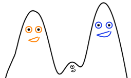

niebla
========

Python package to compute the EBL with a forward folding approach.

Prerequisites
-------------

Python 3.5 or higher and the following packages: 
  
  - numpy 
  - scipy
  - astropy
  - matplotlib

An extra library is required to calculate the intensity of the
intrahalo light. However, implementing it is not trivial in a
virtual environment, I would not recommend to get stuck trying to
implement it if it is not needed:

- hmf

Installation:
------------

You can use pip to install the package: 

    pip install niebla

Example scripts and notebooks are provided on the github page in the
scripts/ and notebooks/ folder, https://github.com/saraporrasbedmar/niebla

License
-------
niebla is distributed under the modified BSD License.
